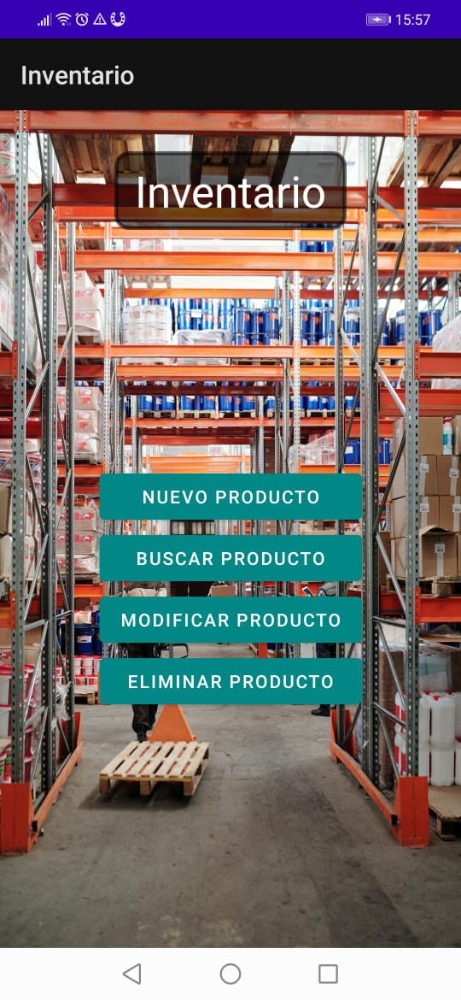
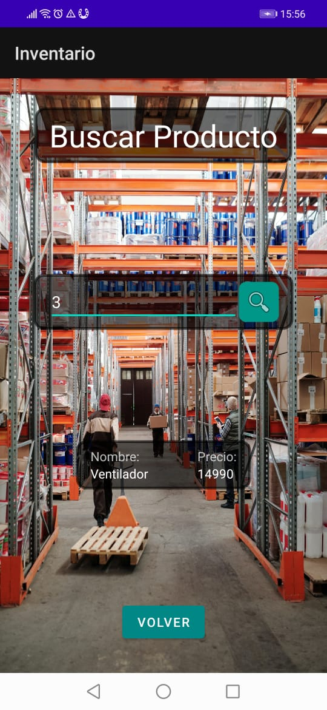
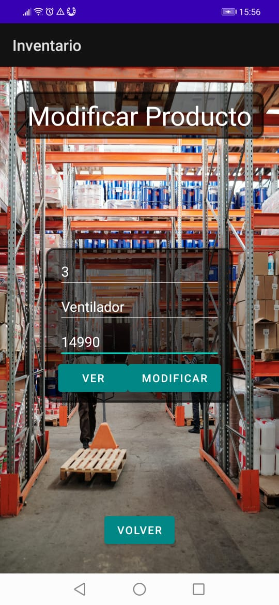
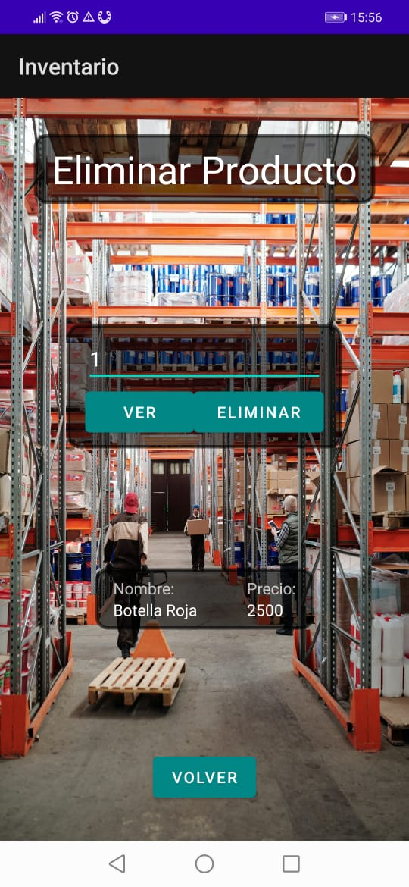

# Evidencia Día 4 Semana 10
## Inventario

### Código main
[Código terminado de la main Activity](./)
### Crear Producto

### Código Crear
[Código Activity Crear](./)
### Buscar Producto

### Código Buscar
[Código Activity Buscar](./)
### Modificar Producto

### Código Modificar
[Código Activity Modificar](./)
### Eliminar Producto

### Código Eliminar
[Código Activity Eliminar](./)

## Reflexión
Cada vez me siento más cómodo con Android Studio. Hoy obtuve resultados estéticos que me dejan bastante contento, ya puedo manejar de mejor manera el Layout y consigo que todo se vea alineado y consistente. Sobre el código, se me hace fácil obtener la funcionalidad para este CRUD básico y he agregado algunas validaciones extras a lo visto en clases para manejar errores.
