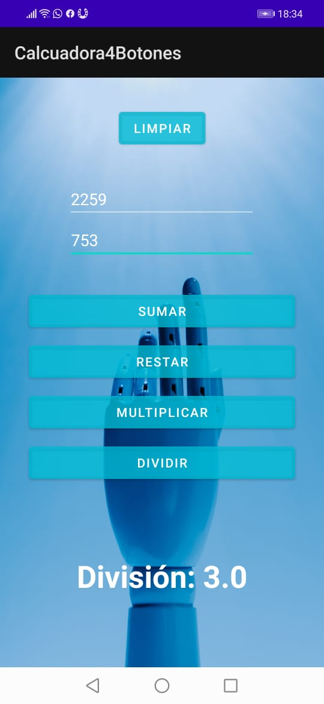

# Evidencia día 5 semana 8
## Calculadora 4 Botones

## Código
[MainActivity de la Aplicación]()

## Reflexión
He encontrado un montón de similitudes con los eventos de JS por lo que me siento bastante cómodo respecto a agregar funcionalidad e interactividad a los distintos elementos. Sin embargo, me siento muy perdido respecto a cómo estructurar el Layout, es muy distinto al CSS que domino y con el que me siento cómodo, cuando quiero darle tamaño o margen a un botón, solo lo consigo arrastrando los elementos con el mouse, lo que considero muy impresiso.
