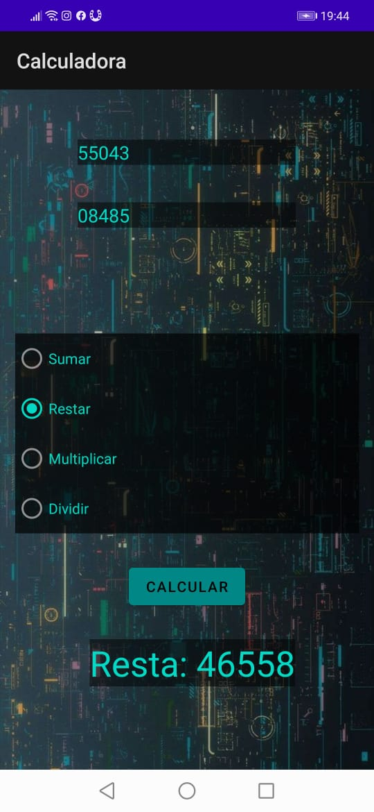
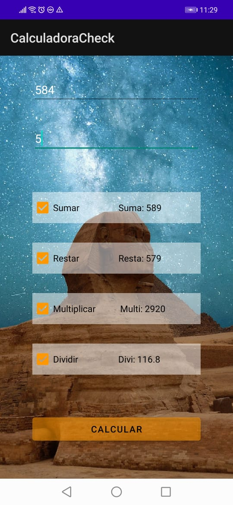

# Evidencia Día 3 Semana 9
## Calculadora Radio Buttons
  
### Main
[Código de la main Activity](https://github.com/SebaFarias/DESARROLLO-DE-APLICACIONES-M-VILES-ANDROID-JAVA/blob/master/22-06-2021/CalculadoraRadio/app/src/main/java/com/example/calculadora/MainActivity.java)
## Calculadora Check Buttons
  
### Main
[Código de la main Activity]()
## Reflexión
