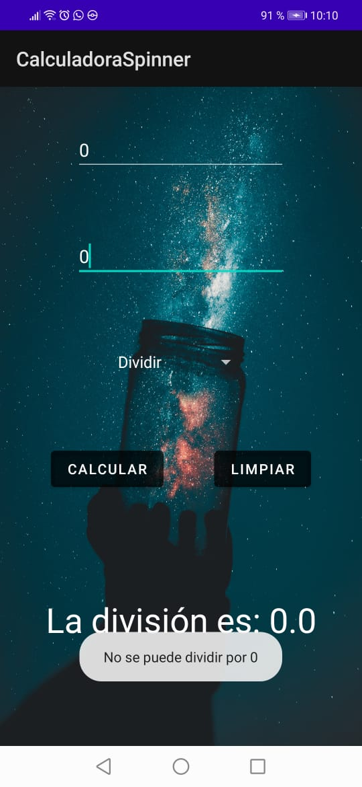

# Día 4 Semana 9
## Componente Switch
### Captura

### Main
[Código de la main Activity](./)

## Componente Spinner
### Captura

### Main
[Código de la main Activity](./)
## Reflexión
Hoy aprendimos a poner la vista de Code además de la de Design que usábamos exclusivamente antes, lo que nos permite tocar el código manualmente y no que se autogenere, lo que me acomoda mucho más. Nunca habá trabajado con XML pero se parece muchísimo al html o al jsx de React con el que tengo más cercanía por lo que me parece bastatnte legible y me gusta.