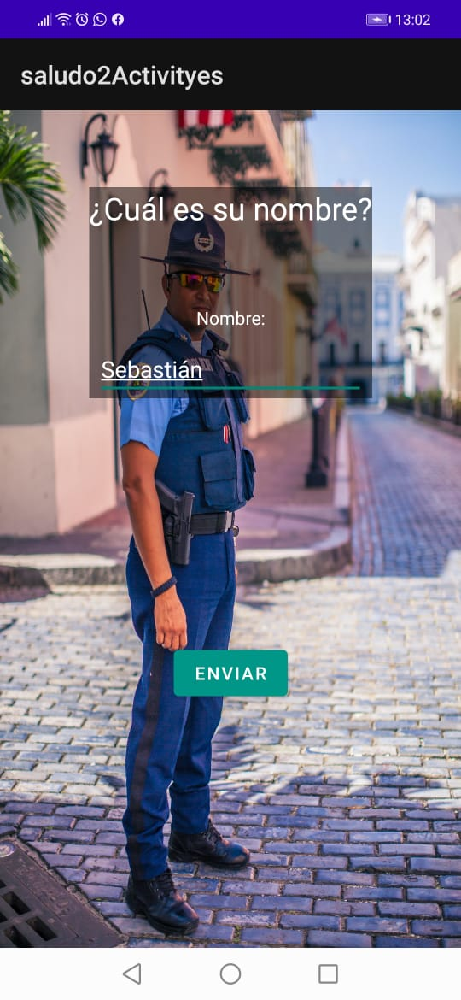

# Evidencia Día 2 Semana 10
## Calculadoras

### Main Activity
[Codigo de la main Activity](./Calcuadoras.jpeg)
## Saludo 

### Main Activity
[Código de la main Activity](./)
[Código de la segunda Activity](./)
## Reflexión
Ahora que podemos usar más de una Activity, cree una recopilación de todas las calculadoras que he hecho durante el curso. Salvo una, me gusta el resultado estético que he conseguido, lo que me tiene muy motivado. Pero el gran aprendizaje del día fue el de poder pasar datos de una activity a otra, que se ejemplifica en la segunda app, que saluda personalizadamente en una Activity distinta, lo que abre una puerta a hacer prácticamente cualquier cosa.
