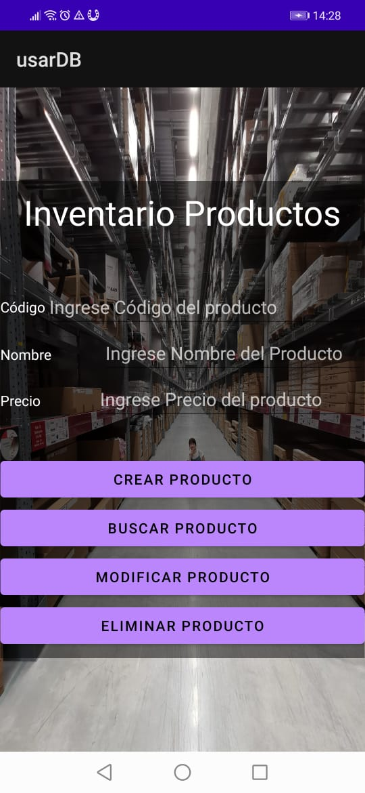

# Evidencia Día 3 semana 10
## Usar Base de Datos

### Clase main
[Código de la clase main](./)
### Clase AdminBD
[Código del administrador de Base de Datos](./)
## Reflexión
Hoy comenzamos a usar una base de datos sql, lo que abre muchas opciones de uso. Hoy pude realizar el ejercicio sin problemas, a diferencia de muchos compañeros a los que se les presentaron varios problemas. Sin embargo, estoy lleno de dudas. Esta base de datos se crea de manera local en el computador, o en el celular que se ejecute? porque lo interesante sería que la base se aloje en un servidor y se consuma mediante una API REST...